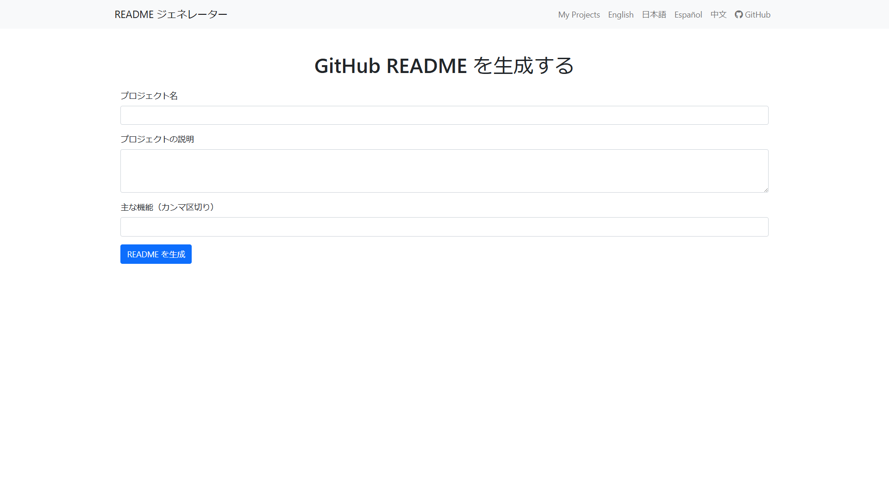

# GitHub README Generator

## 日本語

ご覧いただきありがとうございます。このアプリケーションは、Claude API を使用して、GitHubプロジェクト用のREADMEを簡単に生成するためのツールです。プロジェクト名、説明、主な機能を入力するだけで、整形されたREADMEマークダウンを生成します。

### 実装環境
- Python 3.8+
- Flask 2.0.1
- SQLAlchemy 1.4.46
- その他の依存関係は `requirements.txt` に記載

### ファイル構成
```
README-GeneratorApp/
│
├── app.py                 # メインアプリケーションファイル
├── claude_api.py          # Claude APIとの通信を行うファイル
├── config.py              # 設定ファイル
├── models.py              # データベースモデル
├── requirements.txt       # 依存関係リスト
│
├── static/
│   ├── styles.css         # CSSファイル
│   └── script.js          # JavaScriptファイル
│
├── templates/
│   ├── base.html          # ベーステンプレート
│   ├── index.html         # メインページテンプレート
│   ├── projects.html      # プロジェクト一覧ページテンプレート
│   └── edit_project.html  # プロジェクト編集ページテンプレート
│
└── translations/          # 多言語翻訳ファイル
    ├── en/
    ├── ja/
    ├── es/
    └── zh/
```

### 導入方法
1. リポジトリをクローンします：
   ```
   git clone https://github.com/paraccoli/README-GeneratorApp.git
   cd README-GeneratorApp
   ```
2. 仮想環境を作成し、アクティベートします：
   ```
   python -m venv venv
   source venv/bin/activate  # Linuxの場合
   venv\Scripts\activate     # Windowsの場合
   ```
3. 必要なパッケージをインストールします：
   ```
   pip install -r requirements.txt
   ```
4. `.env` ファイルを作成し、必要な環境変数を設定します：
   ```
   FLASK_APP=app.py
   FLASK_ENV=development
   SECRET_KEY=your_secret_key
   ANTHROPIC_API_KEY=YOUR_API_KEY
   ```
 **Claude API KEYは各自で取得して下さい。** 

### 起動方法
1. データベースを初期化します：
   ```
   flask shell
   >>> from app import db
   >>> db.create_all()
   >>> exit()
   ```
2. アプリケーションを起動します：
   ```
   flask run
   ```
3. ブラウザで `http://localhost:5000` にアクセスします。

## exeファイルの使用方法

アプリケーションをexeファイルとして実行することもできます。以下の手順に従ってください：

1. `Release`からapp.exeをダウンロードします。
2. ルートディレクトリに `app.exe` ファイルを移動させ、ダブルクリックして実行します。
3. ブラウザで `http://localhost:5000` にアクセスしてアプリケーションを使用します。

注意: exeファイルを実行する際は、アンチウイルスソフトウェアによってブロックされる可能性があります。その場合は、ファイルが安全であることを確認した上で、アンチウイルスソフトウェアの設定で許可してください。




## English

Thank you for visiting. This application is a tool for easily generating READMEs for GitHub projects. Simply input your project name, description, and key features to generate a formatted README markdown.

### ENV
- Python 3.8+
- Flask 2.0.1
- SQLAlchemy 1.4.46
- Other dependencies listed in `requirements.txt`

### File Structure
```
README-GeneratorApp/
│
├── app.py                 # Main application file
├── claude_api.py          # File for communicating with Claude API
├── config.py              # Configuration file
├── models.py              # Database models
├── requirements.txt       # List of dependencies
│
├── static/
│   ├── styles.css         # CSS file
│   └── script.js          # JavaScript file
│
├── templates/
│   ├── base.html          # Base template
│   ├── index.html         # Main page template
│   ├── projects.html      # Project list page template
│   └── edit_project.html  # Project edit page template
│
└── translations/          # Multilingual translation files
    ├── en/
    ├── ja/
    ├── es/
    └── zh/
```

### Installation Guide
1. Clone the repository:
   ```
   git clone https://github.com/paraccoli/README-GeneratorApp.git
   cd README-GeneratorApp
   ```
2. Create and activate a virtual environment:
   ```
   python -m venv venv
   source venv/bin/activate  # For Linux
   venv\Scripts\activate     # For Windows
   ```
3. Install the required packages:
   ```
   pip install -r requirements.txt
   ```
4. Create a `.env` file and set the necessary environment variables:
   ```
   FLASK_APP=app.py
   FLASK_ENV=development
   SECRET_KEY=your_secret_key
   ANTHROPIC_API_KEY=YOUR_API_KEY
   ```

### Starting Method
1. Initialize the database:
   ```
   flask shell
   >>> from app import db
   >>> db.create_all()
   >>> exit()
   ```
2. Start the application:
   ```
   flask run
   ```
3. Access `http://localhost:5000` in your browser.

## Using the EXE file

You can also run the application as an exe file. Follow these steps:

1. download the app.exe from `Release`.
2. Double-click the `app.exe` file in the root directory to run it.
3. Access the application by opening `http://localhost:5000` in your browser.

Note: When running the exe file, it may be blocked by antivirus software. If this happens, make sure the file is safe and then allow it in your antivirus software settings.

## 作成者 Developer
- パラッコリー(ID：Paraccoli)
- GitHub: [@Paraccoli](https://github.com/paraccoli)
